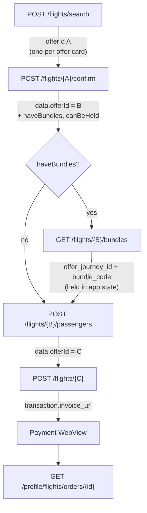

# Flight booking flow — design

**Date:** 2026-08-08
**Status:** Flow settled — ready for screen design. One open item blocks the
success screen only; see [Still open](#still-open).
**Supersedes scope of:** [`2026-08-07-flight-search-screens-design.md`](2026-08-07-flight-search-screens-design.md)
(that spec stopped at "browse offers"; this one carries the flow through to payment)

## Goal

Define the complete flight booking chain — from airport lookup to a payable
invoice — so the mobile screens can be designed against a settled contract.

This document is **flow + contract only**. No screen layouts, no Skyline
styling decisions. It answers: what calls happen, in what order, what each one
needs, what it gives back, and where the state lives.

## Scope

| In | Out |
|----|-----|
| Airport search → search → confirm → bundles → passengers → order → pay | Screen layouts / visual design |
| One-way, round-trip, multi-city request shapes | Hold flow (`canBeHeld`) — see [Deferred](#deferred-hold-trip) |
| Server-side vs local filtering rules | Order cancellation, refunds |
| Passenger composition rules (max 9, INF≤ADT) | Post-payment e-ticket / boarding pass design |

---

## The offer_id relay — the one thing to get right

**The offer id is not stable. It changes twice during the flow.** Every step
must use the id returned by the immediately preceding step, not the one the
user originally selected. Getting this wrong produces
`400 "The Provided Offer Id is not valid or expired."`



| Step | Uses offer id | Returns new id? |
|------|---------------|-----------------|
| Search | — | **A** (one per offer) |
| Confirm | **A** | **B** (`data.offerId`) |
| Bundles | **B** | no |
| Add passengers | **B** | **C** (`data.offerId`) |
| Create order | **C** | no — returns the order |

Two consequences for state design:

1. **Bundles must be fetched before passengers.** Once you POST passengers,
   `B` is dead. The selected `journeyKey` + `bundle_code` are carried in app
   state to the final call.
2. The id is a long base64 string embedded in the URL path. `FlightApi`
   already `Uri.encodeComponent`s it — keep that.

---

## Step-by-step contract

All endpoints: `Bearer` token required, `Accept-Language: ar|en`, and the
standard envelope `{status, message, errors, data}`.

### 0. Airport lookup — `GET /flights/airports/search?term=`

Feeds both the From and To fields. Ranked, not paginated.

```json
{ "iata_code": "DXB", "name": "All Airport", "city": "Dubai",
  "country_code": "AE", "country": "UNITED ARAB EMIRATES",
  "is_domestic": false, "is_all_airport": true, "ranking": 179 }
```

- `is_all_airport: true` = the "all airports in this city" pseudo-entry — show
  it first, it's what most users want.
- Sort by `ranking` descending.
- `term` is required; empty ⇒ `400` with `errors.term`.
- Debounce (~300 ms) and require ≥2 chars.

> `GET /flights/iata` is a paginated dump of all ~9,000 airports. Not used by
> the picker — search is strictly better. Leave it unwired.

### 1. Search — `POST /flights/search`

Request shape **differs by trip type**:

**One-way**
```json
{ "origin": "CAI", "destination": "RUH", "date": "2026-08-30",
  "passengers": [{"passengerTypeCode": "ADT", "count": 1}],
  "sortingCriteria": "CheapestFirst", "cabinClass": "CABIN_CLASS_ECONOMY",
  "directFlightsOnly": false, "trip_type": "one_way", "curreny": "EGP" }
```

**Round-trip** — same, plus `"return_date": "2026-04-10"`, `trip_type: "round_trip"`

**Multi-city** — drops `origin`/`destination`/`date` entirely, replaces them with:
```json
{ "segments": [
    {"origin": "CAI", "destination": "RUH", "date": "2026-04-10"},
    {"origin": "RUH", "destination": "CAI", "date": "2026-04-14"}
  ], "trip_type": "multi_city", ... }
```

> **`curreny` is not a typo to fix.** The backend expects the misspelled key;
> `currency` is silently rejected. Already handled and commented in
> [`flight_dto_mapper.dart:300`](../../../lib/features/flight/data/flight_dto_mapper.dart#L300).
> Note the **final order call uses the correctly-spelled `currency`** — the two
> endpoints disagree, and both spellings are correct for their own endpoint.

**Response** — `data` is a flat array of offers (600+ in real responses, no
pagination):

```json
{ "offerId": "…", "haveBundles": false, "canBeHeld": true,
  "refundability": "FullyRefundable",
  "journeys": [ { "id": "…", "origin": "CAI", "destination": "RUH",
                  "numberOfStops": 0,
                  "segment": [ { "origin": "CAI", "destination": "RUH",
                      "departureDateTime": "2026-08-30T10:35:00+03:00",
                      "arrivalDateTime": "…", "departureTerminal": "T1",
                      "flightTimeInMinutes": 160,
                      "operatingCarrierCode": "NE",
                      "operatingCarrierName": "Nile Air",
                      "operatingCarrierLogo": "https://pics.avs.io/200/200/NE.png",
                      "operatingFlightNumber": "162", "equipment": "321" } ] } ],
  "totalAmount": 12533.8, "taxesAmount": 4268.8, "baseAmount": 8265,
  "discountAmount": 230, "beforeDiscountAmount": 12763.8,
  "serviceChargeAmount": 0, "currency": "EGP",
  "priceClasses": [ { "classId": "…", "priceClassName": "Economy",
                      "fareType": "PublicFare",
                      "rulesAndPenalties": ["Enjoy Nesma airlines…"] } ] }
```

Fields worth knowing:

| Field | Use |
|-------|-----|
| `journeys[]` | 1 entry = one-way, 2 = round-trip, N = multi-city legs |
| `journeys[].segment[]` | legs within a journey; `length > 1` ⇒ has stops |
| `operatingCarrierName` / `Logo` | present in newer responses, **absent in older ones** — treat as nullable, fall back to `operatingCarrierCode` |
| `beforeDiscountAmount` | strike-through price when `discountAmount > 0` |
| `refundability` | `FullyRefundable` \| `PartiallyRefundable` \| `NotRefundable` \| `UnKnown` — render `UnKnown` as "check fare rules", not as a badge |
| `priceClasses[].rulesAndPenalties` | `null` on some providers, `string[]` on others — nullable list |
| `haveBundles` | drives whether the bundle step exists at all |

### 2. Confirm — `POST /flights/{offerId_A}/confirm`

No body. Re-prices and re-validates the offer against the provider. This is
also where the **authoritative** `haveBundles` / `canBeHeld` come from.

```json
{ "offerId": "…B…", "journey_id": "…", "haveBundles": false, "canBeHeld": true,
  "origin": "CAI", "destination": "RUH", "numberOfStops": 0,
  "segments": [ { "segmentId": "…", "cabinCode": "Economy", "rbd": "S",
                  "priceClassReferenceId": "…", "baggageDetailsReferenceId": "…",
                  "operatingCarrierName": "Nile Air", … } ],
  "passengerFareBreakdown": [ { "passengerTypeCode": "ADT",
      "numberOfPassengers": 1, "passengerTotalAmount": 12533.8,
      "passengerTaxesAmount": 4268.8, "passengerBaseAmount": 8265,
      "passengerDiscountAmount": 230, "passengerServiceChargeAmount": 0,
      "segmentDetails": [ … ] } ],
  "priceDetails": { "totalAmount": 12533.8, "taxesAmount": 4268.8,
                    "baseAmount": 8265, "discountAmount": 230,
                    "serviceChargeAmount": 0, "currency": "EGP" },
  "refundability": "FullyRefundable" }
```

- `passengerFareBreakdown` is the per-type price table — exactly what a
  "price details" expander needs (2 adults × X, 1 child × Y).
- **Compare `priceDetails.totalAmount` against the searched offer's
  `totalAmount`.** Providers re-price. If they differ, show a price-change
  notice before letting the user continue.
- Confirming is what makes the offer real. A successful confirm means the trip
  is secured for this session — the offer is not on a countdown from here.

**Journeys are one object per leg** (confirmed by product, 2026-08-08):

| Trip type | `journeys[]` length |
|-----------|--------------------|
| One-way | 1 |
| Round-trip | 2 — outbound, then return |
| Multi-city | one per city the user picked |

This is the rule the bundle picker is built on: **N legs ⇒ N bundle choices**.
The confirm sample flattens to a single `journey_id` because it is a one-way
trip; a round-trip confirm should carry both legs. Worth eyeballing one real
round-trip confirm response before building the picker, since no saved sample
exists yet — but the leg model itself is settled.

### 3. Bundles — `GET /flights/{offerId_B}/bundles`

**Only when `haveBundles == true`.** Skip the whole screen otherwise.

```json
{ "data": [ { "offer_journey_id": "…",
    "bundles": [ { "bundle_code": "RCAI", "bundle_name": "Light",
        "bundle_prices": { "bundle_references": "2",
            "passenger_type_code": "ADT", "total_amount": 0,
            "taxes_amount": 0, "fee_mount": 0, "currency": "EGP" },
        "included_services": ["15KG Check-in Baggage (BULK)", "…"] } ] } ] }
```

- `data` is **one entry per journey**. Round-trip ⇒ two entries ⇒ the user
  picks a bundle **per leg**.
- `offer_journey_id` is the value that becomes `journeyKey` in the final call.
  Capture both it and `bundle_code`.
- `bundle_prices.total_amount: 0` = the baseline bundle, already in the fare.
  Upgrades carry a delta — add it to the displayed total.
- `fee_mount` is spelled that way in the API. Don't "fix" it in the mapper.
- Typical codes seen: `LCAI` (Light), `RCAI`, `VCAI`.

### 4. Passengers — `POST /flights/{offerId_B}/passengers`

One object per traveller, matching the counts sent to search.

```json
{ "passengers": [ {
    "title": "MR", "firstName": "Ahmed", "middleName": "Mostafa",
    "lastName": "Ahmed", "birthDate": "1990-01-02",
    "documentNumber": "299060912312",
    "nationalityCountryCode": "EGP", "residenceCountryCode": "EGP",
    "gender": "M", "email": "…", "phone": "01090510796",
    "passengerTypeCode": "ADT",
    "address": { "countryCode": "EG", "cityCode": "…",
                 "line1": "…", "line2": "…" } } ] }
```

| Field | Notes |
|-------|-------|
| `title` | `MR` / `MRS` / `MS` — **assumed set**, pending the full list from backend |
| `documentNumber` | **national ID**, per the Postman comment — not a passport number |
| `nationalityCountryCode` | **`iso3`** from **`GET /countries`** (confirmed live — see Resolved) |
| `residenceCountryCode` | Same source and same format as nationality |
| `gender` | `M` \| `F` |
| `passengerTypeCode` | `ADT` \| `CHD` \| `INF` — must match search counts |
| `address` | **Required** — `countryCode` (`iso2`), `cityCode`, `line1`, `line2`. Omitting it returns `400` naming those fields. |

> **Live-confirmed 2026-08-09:** nationality and residence take **`iso3`**
> (`"EGY"`). `address.countryCode` takes **`iso2`** (`"EG"`). Adding
> passengers with that pair returns `200` and a new **offer id C** that
> differs from confirm's B. Without `address`, the same call fails with
> `The passengers.0.address field is required.`

Returns only `{ "offerId": "…C…" }`.

**Infants need no explicit link to an adult.** The counts alone are enough for
the provider — confirmed by product, 2026-08-08. The client still enforces
`INF ≤ ADT` before search.

### Supporting calls

**`GET /countries`** — backs the nationality and residence pickers.

```json
{ "data": [ { "name": "Egypt", "iso2": "EG", "iso3": "EGY", "phonecode": "20" },
            { "name": "Saudi Arabia", "iso2": "SA", "iso3": "SAU", "phonecode": "966" } ] }
```

Send `iso3` for the two passenger fields, `iso2` for `address.countryCode`.
`phonecode` also backs the phone-number field.

> The app currently ships a **hardcoded** country list in
> [`country_picker.dart`](../../../lib/features/auth/presentation/widgets/country_picker.dart)
> — dial codes and flags only, no ISO codes, with a `wire /countries later`
> comment on it. It cannot feed this form. Fetching `/countries` and either
> extending or replacing that picker is part of this work.

**`GET /settings`** — the source of the currency sent as `curreny` (search) and
`currency` (order), plus the single payment gateway.

```json
{ "data": { "default_booking_currency": "EGP",
            "payment_gateway": "myfatoorah", "refundRules": [] } }
```

Take `default_booking_currency` and send it. There is **no currency picker**
and no payment-method picker — one value, one gateway.

**`GET /currencies`** lists the supported currencies. Not needed for the
booking flow while a single default exists; leave it unwired until a
multi-currency requirement appears.

```json
{ "data": [ { "id": 1, "code": "EGP", "name": "Egyptian Pound" } ] }
```

None of these three calls is wired anywhere in the app yet.

### 5. Create order — `POST /flights/{offerId_C}`

```json
{ "selectedBundles": [ { "journeyKey": "…offer_journey_id…",
                         "selectedBundleCode": "RCAI" } ],
  "currency": "EGP" }
```

Note `currency` — correctly spelled here, unlike search.

Returns the full order:

```json
{ "id": 76, "provider": "flywt", "status": "pending",
  "order_status": "PendingPayment", "offer_id": "…",
  "ndc_booking_reference": null, "airline_pnr": null, "gds_pnr": null,
  "total_amount": 13048.86, "base_amount": 6446.36, "taxes_amount": 6602.5,
  "discount_amount": 0, "currency": "EGP",
  "order_data": { "priceDetails": {…}, "selectedBundles": […] },
  "passengers": [ { "id": 81, "passenger_type_code": "ADT", … } ],
  "segments": [ { "id": 105, "origin": "CAI", "destination": "MED",
                  "departure_datetime": "2026-08-30T16:30:00+03:00", … } ],
  "journeys": [ { "id": 79, "journey_reference_id": "…",
                  "number_of_stops": 1, "segment_reference_ids": […] } ],
  "transaction": { "id": 120, "gateway": "myfatoorah", "status": "pending",
                   "paid_at": null, "invoice_url": "https://eg.myfatoorah.com/…",
                   "invoice_id": 8285523 },
  "can_be_cancel": true,
  "invoice_url": "https://demo.safaria.travel/flight-orders/76/invoice?…" }
```

> **Two different `invoice_url`s.** `transaction.invoice_url` is the
> **gateway checkout page** — that's the one the WebView loads.
> Top-level `invoice_url` is REGO's own **receipt document**. Do not confuse
> them; loading the wrong one gives the user a receipt for an unpaid order.

Also note this response switches to `snake_case` — it's the Laravel order
model, not the provider passthrough used by steps 1–4. The DTO mapper needs
both conventions.

**When `haveBundles == false`, send an empty array** — confirmed by product,
2026-08-08:

```json
{ "selectedBundles": [], "currency": "EGP" }
```

Do not omit the key.

### 6. Pay — WebView on `transaction.invoice_url`

Identical to the bus and car flows. Reuse the established pattern from
[`payment_webview_screen.dart`](../../../lib/features/bus/presentation/payment_webview_screen.dart):

- Load `transaction.invoice_url` (MyFatoorah hosted checkout).
- **Never attach the bearer token** to a third-party gateway host.
- Classify navigations: path contains `success-payment` ⇒ success,
  `failed-payment` ⇒ failure, anything else ⇒ still in progress.
- Intercept the terminal redirect (`NavigationDecision.prevent`) and verify
  server-side — never grant a ticket off a client-side redirect.
- "Leave payment?" confirmation on back-press.

### 7. Verify — `GET /profile/flights/orders/{id}`

The authoritative post-payment check.

```json
{ "id": 76, "status": "pending", "order_status": "PendingPayment",
  "payment_status": "pending",
  "payment_transactions": [ { "status": "pending", "paid_at": null,
                              "invoice_url": "…", "invoice_id": 8285523 } ],
  "airline_pnr": null, "gds_pnr": null, "ndc_booking_reference": null,
  "included_bundles": [], "bundles_total": 0,
  "confirmed_totals": null,
  "totals_comparison": { "currency_match": null, "total_amount": null, … },
  "provider_passengers": [ … ], "can_be_cancel": true }
```

Paid ⇒ `airline_pnr` / `gds_pnr` populate and `order_status` moves off
`PendingPayment`. **The exact paid-state values are not in any saved sample** —
same gap the bus flow has (see the `bus-payment-order-status-gap` note). Confirm
the enum with the backend rather than guessing.

`GET /profile/flights/orders` (list) backs My Tickets. Note the two Postman
collections disagree on the path — `/profile/flights/orders` (v1, has saved
responses) vs `/profile/orders/flights` (v2, empty). Trust v1.

---

## Filtering and sorting — server-side vs local

> **Correction to the brief.** The search *response* carries no filter
> metadata — no `filters` object, no airline list, no price bounds. It is a
> bare array of offers. Everything a filter panel needs must be derived from
> the returned offers.

The only server-side knobs are **request fields**, and changing any of them
means re-running the search:

| Control | Server-side? | Mechanism |
|---------|--------------|-----------|
| Sort (cheapest / fastest / earliest…) | ✅ | `sortingCriteria` → re-search |
| Cabin class | ✅ | `cabinClass` → re-search (**single value**) |
| Direct flights only | ✅ | `directFlightsOnly` → re-search |
| Currency | ✅ | `curreny` → re-search |
| Price range | ❌ local | derive min/max from `totalAmount` across offers |
| Airline | ❌ local | derive distinct `operatingCarrierCode` + name/logo |
| Refundable only | ❌ local | `refundability != "NotRefundable"` |
| Stops count | ❌ local | `journeys[].numberOfStops` |
| Departure time bands | ❌ local | `segment[0].departureDateTime` |

Two design consequences:

1. **Split the UI accordingly.** Server-side controls cost a network round-trip
   and reset the list — put them in the sort bar / search-edit sheet with a
   loading state. Local filters are instant — put them in a filter sheet with
   live result counts.
2. **The web app's multi-select "Flight booking class" checkboxes cannot be
   reproduced faithfully.** The API takes one `cabinClass` per search. On
   mobile, make cabin class a **search input** (single-select, in the search
   form), not a results filter. Anything else silently lies to the user.

The three summary chips in the web results header (`3502.05 EGP : Cheapest`,
`1h 10m : Slowest`, `18:15 : Latest Departure`) are `sortingCriteria`
shortcuts — `CheapestFirst`, `SlowestFirst`, `LatestDepartureFirst`.

---

## Passenger composition rules

Enforced client-side in the passenger picker, before search:

| Rule | Value |
|------|-------|
| Total passengers | **max 9** (ADT + CHD + INF) |
| Adults | ≥ 1, age 12+ |
| Children | age 2–11 |
| Infants | under 2, **max 1 per adult** (`INF ≤ ADT`) |

Sent as one array entry per non-zero type; omit types with `count: 0`:

```json
"passengers": [ {"passengerTypeCode":"ADT","count":2},
                {"passengerTypeCode":"CHD","count":1} ]
```

The passenger form in step 4 must produce exactly this many objects, with
matching `passengerTypeCode`s. Age boundaries should be validated against
`birthDate` **relative to the departure date**, not today — a child who turns
12 before departure travels as an adult.

---

## Screen map

| # | Screen | Backing call | Status |
|---|--------|-------------|--------|
| 1 | Search form (Home flight tab) | — | ✅ exists, **adults-only** |
| 2 | Airport picker sheet | `airports/search` | ✅ exists |
| 3 | Passenger & class picker | — | ⚠️ exists, needs CHD/INF + the 9/INF≤ADT rules |
| 4 | Results list + sort bar | `flights/search` | ✅ exists, no sort/filter UI |
| 5 | Filter sheet (local) | — | ❌ new |
| 6 | Offer details / review | `confirm` | ⚠️ exists as read-only; needs the confirm call + price-change notice |
| 7 | Bundle picker (per journey) | `bundles` | ❌ new, conditional on `haveBundles` |
| 8 | Passenger details form (×N) | — | ❌ new |
| 9 | Review & pay | `passengers` → create order | ❌ new |
| 10 | Payment WebView | `transaction.invoice_url` | ♻️ reuse bus/car pattern |
| 11 | Success / pending result | `orders/{id}` | ❌ new |
| 12 | My Tickets — flight orders | `profile/flights/orders` | ❌ new |

## State design

One `FlightBookingNotifier` owning the whole chain, mirroring
`busBookingProvider`. The existing notifier only handles search — extend it:

```dart
enum FlightBookingStep {
  idle, searching, results,
  confirming, confirmed,        // holds offerId_B
  loadingBundles, bundles,      // holds journeyKey → bundleCode map
  passengers,                   // holds the passenger forms
  creatingOrder,                // POSTs → offerId_C → order
  awaitingPayment, verifying, paid, failed,
}
```

State must carry, at minimum: `searchParams`, `offers`, `selectedOffer`,
`confirmedOffer` (with `offerId_B`), `selectedBundles` (journeyKey →
bundle_code), `passengers`, `orderId`, `checkoutUrl`.

Per the project's **full-isolation** convention, this is a flight-owned
notifier — do not extract a shared booking core with bus/car.

## Failure modes

| Failure | Where | Handling |
|---------|-------|----------|
| `400 "Offer Id is not valid or expired"` | any step after search | **Almost always our own bug** — see below |
| Price changed at confirm | step 2 | Explicit notice + user must re-accept before continuing |
| Passenger validation rejected | step 4 | `errors` is a map of field → message (string, sometimes array — the app already normalizes both) |
| Payment abandoned | step 6 | Order exists as `PendingPayment` — must be resumable from My Tickets, same as bus |
| Verify says unpaid | step 7 | Route to pending screen, not success |

> **The expiry error is a relay bug, not a TTL** (confirmed by product,
> 2026-08-08). Once the user picks a flight and confirm succeeds, the trip is
> secured — offers do not quietly expire underneath the booking flow. Every
> occurrence seen so far came from sending the **wrong offer id** at a step,
> which is what the [relay table](#the-offer_id-relay--the-one-thing-to-get-right)
> exists to prevent.
>
> So: **no countdown timer, no "fare expired" recovery flow** in the screen
> design. Still map the error to a readable message and send the user back to
> results, but treat it as a bug signal during development rather than a state
> the UI is built around.

## Deferred: Hold trip

`POST /flights/{offer_id}/hold` with
`{"_selectedBundles": [{"journeyKey": …, "selectedBundleCode": …}]}`, gated on
`canBeHeld`. Note the leading underscore — inconsistent with the final call's
`selectedBundles`, and there is **no saved response**. Out of scope until the
backend confirms the contract and which offer id it takes.

## Resolved — 2026-08-08

Answered by product; folded into the sections above.

| # | Question | Answer |
|---|----------|--------|
| 1 | `selectedBundles` with no bundles | Send `[]` — don't omit the key |
| 3 | `iso3` vs `iso2` for passenger country fields | **Resolved 2026-08-09 (live spike).** Both fields are real country codes from `GET /countries`. Sample `"EGP"` was a typo for `iso3` `"EGY"`. Live: `nationalityCountryCode` / `residenceCountryCode` accept **`iso3`** with `200` and a new offer id **C ≠ B**. `address.countryCode` remains **`iso2`**. Constant: `kPassengerCountryCodeWidth = iso3`. |
| 4 | Journey shape | One object per leg: 1 one-way, 2 round-trip, N multi-city |
| 5 | Infant → adult pairing | Not needed — counts alone are enough |
| 6 | Offer TTL | No TTL. Confirm secures the trip; expiry errors were a wrong-id bug |
| 2 | Round-trip confirm / bundles sample | **Resolved 2026-08-08 (live spike).** Confirm mints a new offer id (A ≠ B). `GET …/bundles` with B returns 200 with **one `data[]` entry per leg** (2 for round-trip). Same call with A returns `400 "…not valid or expired"`. Fixture: `test/features/flight/data/flight_bundles_fixture.dart`. |
| 7 | `bundle_prices` for mixed party | **Resolved 2026-08-08 (live spike, 2 ADT + 1 CHD).** Still a **single object** (not an array), carrying only `passenger_type_code: ADT`. No CHD price entry. Upgrade deltas matched prior 1-ADT samples — treat as **per passenger of that type** and multiply by matching headcount; CHD contributes 0 unless a CHD row appears. |
| 8 | `address` requiredness | **Resolved 2026-08-09 (same spike).** Address is **required** — omitting it returns `400` for `address`, `countryCode`, `cityCode`, `line1`, `line2`. Passenger form must collect it. |

## Assumptions — decided here, confirm later

Product asked to proceed on judgment for these. Each is cheap to change:

| Assumption | Decision | If wrong |
|------------|----------|----------|
| ~~`address` requiredness~~ | **Resolved 2026-08-09** — required; form collects country/city/lines. | — |
| `title` allowed values | **`MR` / `MRS` / `MS`.** Derive the default from `gender`, let the user override. | Extend the dropdown |
| ~~Currency source~~ | **Resolved 2026-08-08** — `default_booking_currency` from `GET /settings`. No picker at all. | — |
| Passenger form prefill | First adult prefills from the signed-in profile — name, email, phone. | — |

## Still open

1. **Paid-state enum** — which `order_status` / `payment_status` values mean
   "ticketed". Product is collecting the full list from backend. Blocks the
   success screen only; everything upstream can be built now.

   **2026-08-09 live spike (Phase 4 Task 9).** Confirmed the **unpaid** side
   on the demo environment: a naturally-pending order (id 76, created
   2026-08-08) and a freshly created order (id 77) both read back as
   `"status": "pending"`, `"order_status": "PendingPayment"`,
   `"payment_status": "pending"`, `payment_transactions[0].status: "pending"`,
   `paid_at: null`, `airline_pnr: null`, `gds_pnr: null`. This matches the
   samples already in this doc and is now observed twice independently.

   Attempted to also observe the **paid** side by completing order 77's
   checkout (`transaction.invoice_url`, MyFatoorah/`eg.myfatoorah.com`) using
   MyFatoorah's own published sandbox test cards
   (`4508750015741019` and `5123450000000008`, per
   [MyFatoorah's test-cards docs](https://docs.myfatoorah.com/docs/test-cards)) —
   never a real card, and only on `demo.safaria.travel`. Both attempts were
   declined by the gateway ("Payment failed", redirected to
   `safaria.travel/en/failed-payment`), and re-reading order 77 afterwards
   showed **no change**: still `"pending"` / `"PendingPayment"` / transaction
   `"pending"` with `paid_at: null`. This demo merchant account does not
   appear to accept MyFatoorah's documented sandbox cards the way a normal
   MyFatoorah test account would (it may not be registered as a MyFatoorah
   demo account per their activation step, or the two published card numbers
   are gateway/currency-specific) — either way, no paid order has been
   observed, live or otherwise.

   `isFlightOrderPaid` (`lib/features/flight/domain/utils/flight_order_status.dart`)
   is therefore **still provisional** — its paid-status sets are a reasonable
   guess, not observed values, and this open question stays open. Do not
   invent paid values; confirm with the backend team (Step 1 of Task 9)
   before replacing the predicate's provisional sets.
2. ~~**Round-trip confirm sample**~~ — resolved above (2026-08-08 live spike).
3. ~~**`iso3` vs `iso2`**~~ — resolved above (2026-08-09 live spike).

## Current repo state

`lib/features/flight/` has data + domain + a partial presentation layer:

- ✅ `FlightApi` already has methods for **all eight** endpoints.
- ✅ Entities + mapper for airports, offers, and confirmed orders.
- ⚠️ `FlightSearchParams` is **one-way only** — no `return_date`, no
  `segments[]` for multi-city.
- ⚠️ `FlightRepository` exposes only search + `confirmOrder`; bundles,
  passengers, and order creation are unmapped raw JSON.
- ⚠️ **Stale doc comments.** `flight_api.dart` says the bundles and pending
  responses are "unconfirmed" and that pending 404'd. Both now have working
  200 samples in the Postman collection (`docs/Wadeny.postman_collection.json`)
  and are documented above — those comments should be updated when the calls
  are wired.
- ❌ No booking state beyond search, no flight orders integration.
- ❌ `GET /countries`, `GET /settings`, and `GET /currencies` are all unwired;
  the auth country picker is a hardcoded dial-code list with no ISO codes.
