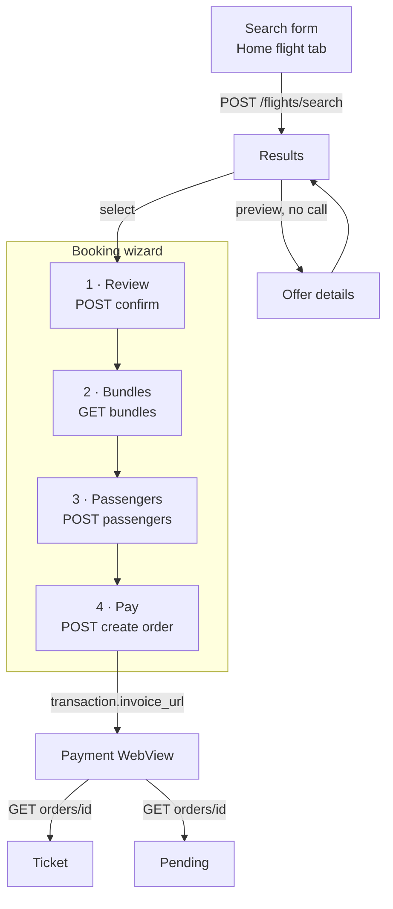

# Flight booking screens — design

**Date:** 2026-08-08
**Status:** Approved in brainstorming — ready for an implementation plan
**Contract reference:** [`2026-08-08-flight-booking-flow-design.md`](2026-08-08-flight-booking-flow-design.md)
**Extends:** [`2026-08-07-flight-search-screens-design.md`](2026-08-07-flight-search-screens-design.md)

## Goal

Design the mobile screens that carry a rider from the Home flight tab to a paid
ticket, against the API chain settled in the flow spec.

That spec answers *what the calls are*. This one answers *what the rider sees*.

## Scope

| In | Out |
|----|-----|
| All three trip types — one-way, round-trip, multi-city | Hold flow (`canBeHeld`) |
| Results + unified filter sheet | Order cancellation and refunds |
| The four-step booking wizard | Boarding-pass / e-ticket visual design |
| Passenger entry with local save | Wallet as a payment source |
| Payment and outcome screens | |

## Decisions

Confirmed with product during brainstorming, 2026-08-08:

| Question | Decision |
|----------|----------|
| Trip types in v1 | **All three**, including multi-city |
| Flow structure | **Four-step wizard**, matching the bus booking pattern |
| Passenger entry | **List of passengers → full screen per passenger**, not stacked forms |
| Passenger data reuse | Profile prefills the first adult; entered travellers saved **locally** |
| Filters | **One unified sheet** holding both server-backed and local controls |
| Cabin class | Single-select, five values, `Economy` default |
| Payment methods | **One gateway**, no selection screen |
| Currency | `default_booking_currency` from `GET /settings` — **no picker** |

---

## Screen map

Step 2 is skipped entirely when `haveBundles` is false — the step bar renders
three nodes instead of four. No greyed-out, unreachable step.

### Routes

Following the `/flight` prefix already established in `flight_routes.dart`:

| Screen | Route | Status |
|--------|-------|--------|
| Results | `/flight/results` | exists |
| Offer details | `/flight/offer-details` | exists |
| Review | `/flight/review` | new |
| Bundles | `/flight/bundles` | new |
| Passenger list | `/flight/passengers` | new |
| Passenger form | `/flight/passengers/form` | new |
| Payment | `/flight/pay` | new |
| Pending | `/flight/pending` | new |
| Ticket | `/flight/ticket` | new |

**Two actions on each offer card.** "Details" opens a read-only preview with no
network call and no commitment. "Select" enters the wizard and fires confirm.
A rider can compare five offers in detail without burning five confirm calls.

---

## 1. Search form

A segmented control at the top switches trip type; the body morphs beneath it.

| Trip type | Body |
|-----------|------|
| One-way | From · To · Date |
| Round-trip | From · To · Departure date · Return date |
| Multi-city | A list of legs, each From · To · Date |

**Multi-city rules:**

- Each new leg's origin **prefills from the previous leg's destination**,
  editable. In most itineraries this is exactly right and saves a full airport
  search.
- Leg *N*'s date cannot precede leg *N−1*'s.
- **Maximum 5 legs.** This is our cap, not the API's — no limit is documented.
  Chosen because the form stops being usable past that on a phone.
- Legs are removable; the first is not.

**Switching trip type keeps leg 1 and discards the rest.** Going from
multi-city to one-way preserves the first From/To/Date and silently drops the
extra legs.

**Cabin class** — single-select, mapping to the wire values:

| Shown | Wire value |
|-------|-----------|
| All | `CABIN_CLASS_UNSPECIFIED` |
| Economy | `CABIN_CLASS_ECONOMY` |
| Premium economy | `CABIN_CLASS_PREMIUM_ECONOMY` |
| Business | `CABIN_CLASS_BUSINESS` |
| First | `CABIN_CLASS_FIRST` |

`Economy` is the default. `All` is available but not preselected — a default of
`All` floods an ordinary rider with first-class fares.

> The current picker in `home_flight_class_picker.dart` has only three entries
> (`economy`, `business`, `first`). It needs premium economy and all. The
> domain enum `FlightCabinClass` already carries all five.

**Passenger sheet** — adults / children / infants with live validation:

| Rule | Value |
|------|-------|
| Total | max 9 |
| Adults | ≥ 1, age 12+ |
| Children | age 2–11 |
| Infants | under 2, **max 1 per adult** |

When a limit is hit the increment control disables **and a line states the
reason** — "one infant per adult", or "9 passengers maximum". A dead button
with no explanation is the failure mode to avoid here.

Date range stays capped at the existing `_maxBookingDays = 90`.

## 2. Results

**A round-trip offer is one card showing both legs**, not two cards. The API
returns the offer as a single priced unit — the rider cannot mix an outbound
from one carrier with a return from another, so presenting them separately
would promise something that does not exist. Multi-city follows the same rule:
one card, N legs stacked.

Card contents: carrier logo and name, cabin, refundability badge, each leg's
times/airports/duration/stops, price (with the pre-discount price struck
through when `discountAmount > 0`), and the two actions.

`operatingCarrierName` and `operatingCarrierLogo` are **nullable** — older
responses omit them. Fall back to `operatingCarrierCode`.

### The unified filter sheet

One sheet, two visually separated groups, each **labelled with its cost**:

| Group | Controls | Badge |
|-------|----------|-------|
| Server | Sort, cabin class, direct-only | "new search" |
| Local | Price range, airlines, refundable-only, stops | "instant" |

That badge is what makes a single sheet workable — without it the rider cannot
tell which toggle will throw the list away.

**Local selections survive a re-search.** When a server control changes and new
results arrive:

- **Airlines** — keep every selection still present in the new results; drop
  the rest silently.
- **Price range** — if the rider never touched it, re-derive from the new
  bounds. If they did, clamp their range to the new bounds rather than
  discarding it.
- **Toggles** (refundable, stops) — carry over untouched; they aren't
  data-dependent.

**The apply button counts before it applies** — "Show 63 flights", live as the
rider toggles. Nobody should tap apply and discover an empty list.

**Pagination is ours.** A real search returned 600+ offers with no server
paging. Render an initial window (~20) and extend on scroll; a single
600-card build will jank on low-end devices.

**Empty state** — when local filters exclude everything, the action is "clear
filters", not "search again". The results still exist; we're hiding them.

## 3. Wizard step 1 — review

Calls confirm on entry, showing a loading state. On success it renders the
confirmed trip and a price breakdown built from `passengerFareBreakdown` — per
passenger type, not recomputed locally.

**When the price changed, the button changes too.** Instead of "Next" it reads
"Accept and continue", above both the old and new totals. This turns a habitual
tap into a deliberate one. The rider can also go back to results from here.

## 4. Wizard step 2 — bundles

Rendered only when `haveBundles` is true. **One section per leg** — the bundle
picker is built on the settled rule that `journeys[]` carries one object per
leg.

Each bundle shows its name, its price delta (or "included" at zero), and its
`included_services` list. **A leg collapses to a one-line summary once chosen**,
which is what keeps a five-leg itinerary readable. The running total sits above
the CTA and updates with each selection.

Selected `offer_journey_id` + `bundle_code` pairs are held in state — they must
survive the passenger step, which invalidates the offer id they were fetched
under.

## 5. Wizard step 3 — passengers

**Contact details are captured once**, at the top of the list, and written into
every passenger object. The API takes email and phone per traveller, but in
practice these are the booker's. For a party of four this alone removes six
fields.

**The list names what is missing** — "national ID missing", not a bare red dot.
Each row shows the passenger's label (fixed by the search counts, not editable
here), completion state, and opens a full screen on tap. "Next" stays disabled
until every row is complete.

### Passenger form

| Field | Notes |
|-------|-------|
| Title, gender | Title defaults from gender, overridable |
| First / middle / last name | **Latin script, LTR**, hinted "as printed on your passport" |
| Birth date | Validated against the **departure date**, not today |
| National ID | Egyptian NID is 14 digits |
| Nationality, residence | Country picker backed by `GET /countries` |

**Names are LTR and Latin inside an otherwise RTL app.** This is not an
inconsistency — carriers match the name to the travel document, and an Arabic
name is rejected at the gate. Use the existing `ltr_text.dart` treatment.

**Age is classified relative to departure.** A child who turns 12 before the
flight must be booked as an adult.

**Saved travellers** appear as chips at the top of the form; tapping one fills
it. Saving is opt-in per passenger.

### Data at rest

Saved travellers hold full name, birth date, and national ID. That is identity
data, not UI preference. It goes in `core/storage/secure_storage.dart`, never
in plain preferences.

**The rider must be able to delete them.** A management entry in the profile
screen is part of this work — it is easy to omit and would leave the app
holding national ID numbers with no way to clear them.

## 6. Wizard step 4 — review and pay

The last chance to check everything before money moves. It shows the itinerary,
the passenger list read-only, the selected bundle per leg, and the final total
with its tax and discount lines.

The CTA creates the order and, on success, pushes straight to the payment
WebView with the returned checkout URL. Failures here leave the rider on this
screen with the message — the passengers and bundles are already committed
server-side, so there is nothing to re-enter.

The booking-terms checkbox (`shared/widgets/booking_terms_checkbox.dart`) gates
the CTA, matching bus and car.

## 7. Payment

Reuses the bus pattern in `payment_webview_screen.dart` without visual change:
load the gateway page, classify navigations by `success-payment` /
`failed-payment` in the path, prevent the terminal redirect from loading, then
verify server-side. Back-press asks before abandoning.

The checkout URL is **`transaction.invoice_url`**, not the top-level
`invoice_url` — the latter is a receipt.

Only one gateway exists (`payment_gateway` in settings), so there is **no
payment-method selection screen**.

## 8. Outcomes

Verification against `GET /profile/flights/orders/{id}` routes to either the
ticket or the pending screen. An unpaid order stays resumable from My Tickets,
exactly as bus orders do.

**The paid test is isolated in a single predicate.** The status values meaning
"ticketed" are still unknown (see [Open](#open)); confining the check to one
function means the eventual answer is a two-line change, not a three-screen
one.

---

## State

A single `FlightBookingNotifier`, extending the existing search-only notifier
and mirroring `busBookingProvider`. Per the project's full-isolation
convention, **no shared booking core with bus or car.**

State carries: `searchParams`, `offers`, `filterState`, `selectedOffer`,
`confirmedOffer` (offer id B), `selectedBundles`, `contactDetails`,
`passengers`, `orderId`, `checkoutUrl`.

**Each wizard step asserts the previous step's state exists**, and redirects to
results otherwise. This stops a restored route or an odd back-stack from
opening a mid-flow step against empty state.

## Errors

| Error | Handling |
|-------|----------|
| Invalid/expired offer id | Readable message, back to results. Per the flow spec this signals a relay bug, so it also warrants a log — no countdown timer, no recovery flow built around it. |
| Price changed at confirm | Explicit re-acceptance, per step 1 |
| Passenger validation rejected | See below |
| Payment abandoned | Order remains `PendingPayment`, resumable from My Tickets |

**Passenger errors must route back to their owner.** The API's `errors` map is
expected to key by index — `passengers.1.documentNumber`. Parse the index,
mark that row in the list, and surface the message on that field in that
passenger's form. A generic banner on a nine-passenger screen tells the rider
nothing about which traveller to fix.

## New supporting calls

None of these are wired today:

| Call | Feeds |
|------|-------|
| `GET /countries` | Nationality and residence pickers, phone codes |
| `GET /settings` | `default_booking_currency`, `payment_gateway` |

The auth country picker is currently a hardcoded dial-code list with no ISO
codes and cannot serve the passenger form. Replacing or extending it is in
scope.

## Testing

Four things carry real risk and get real tests:

1. **Passenger count rules** — the 9 cap and `INF ≤ ADT`, including the
   disable-with-reason behaviour.
2. **Age classification against departure date**, not today.
3. **Local filter preservation across a re-search** — airlines dropped,
   price range clamped, toggles carried.
4. **The offer id relay** — that each step sends the id from its immediate
   predecessor. This is the single most likely source of defects in the flow.

The first three are pure logic with no widget dependency. Widget tests cover
wizard step gating and passenger-list completion state.

## Suggested phasing

This is more than one implementation plan's worth of work — six new screens,
two new API integrations, a search form rebuild, and a secure-storage feature.
Four phases, each leaving the app in a coherent state:

| Phase | Contents | Ends at |
|-------|----------|---------|
| 1 | Search form with all three trip types, results, unified filter sheet | Rider can browse real fares |
| 2 | Wizard steps 1–2: review and bundles | Rider can price a trip precisely |
| 3 | `GET /countries`, passenger list and form, secure storage, profile management of saved travellers | Rider can enter travellers |
| 4 | `GET /settings`, order creation, payment, outcomes, flight orders in My Tickets | Rider can pay |

Phases 1–3 sit behind the existing gate on the flight tab; only phase 4 exposes
booking to riders. Phase 3 is the largest and the only one that touches
storage and the profile screen, so it is the natural place to split further if
needed.

## Open

1. **Paid-state values** — which `order_status` / `payment_status` mean
   ticketed. Blocks only the outcome branch; product is collecting them.
2. **Bundle pricing across passenger types** — `bundle_prices` is a single
   object carrying one `passenger_type_code`. For a mixed party, is it an
   array per type, or one figure multiplied by head count? Getting this wrong
   makes the displayed total disagree with the amount charged. Needs one
   bundles call on a booking with more than one passenger type.
3. **`iso3` vs `iso2`** for the passenger country fields — inferred, not
   stated. One test request settles it.
