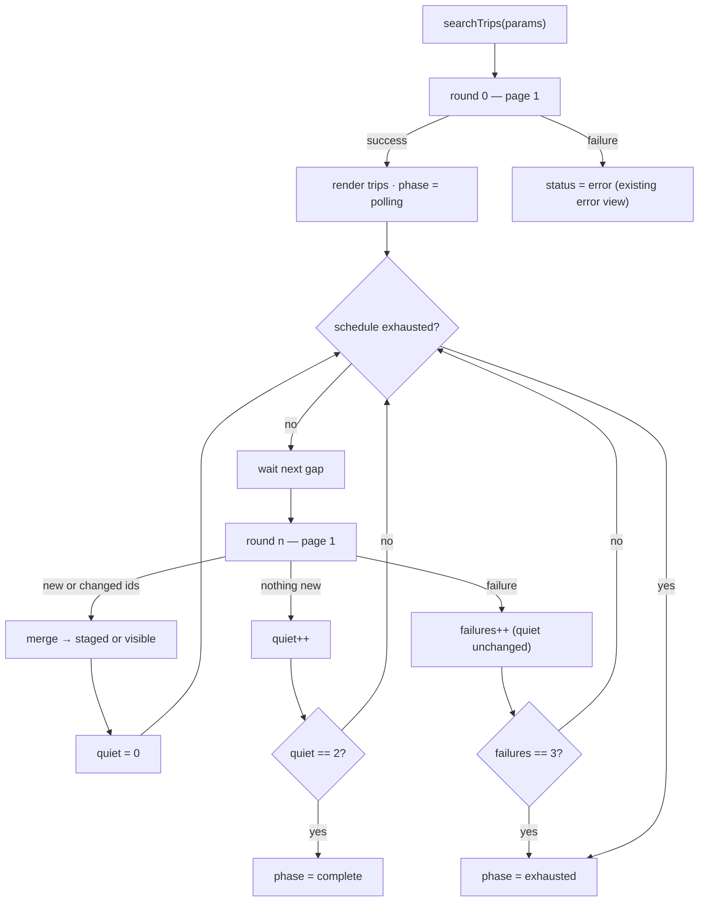

# Bus progressive search — design

**Date:** 2026-08-15
**Status:** Design approved — ready for an implementation plan.
**Feature slice:** `lib/features/bus/` (bus only; flight and private car keep their
current single-shot search — see [Deferred](#deferred))

## Goal

`GET /buses/trips` aggregates live inventory from several operator APIs
(Blue Bus, Super Jet, Telefreik, Distribusion, …). Slow operators miss the
server's own response window, so the first call returns a partial list and a
repeat call 3–5 seconds later returns a larger one.

Today the app makes exactly one call and treats its result as the complete
answer. Riders are shown a truncated list of trips with no indication that more
are coming, and the cheapest or best-timed option is frequently among the ones
that never arrive.

This design makes the results screen fill in progressively over a bounded
window, and defines the backend contract that would let us stop guessing.

## Scope

| In | Out |
|----|-----|
| Repeated searches over a bounded window, merged by trip id | Any change to flight or private-car search |
| Stop conditions, cancellation, lifecycle | Wiring `loadMoreTrips` into the results screen — see [Deferred](#deferred) |
| Staged reveal so the list does not jump under the rider's finger | Server-side implementation (we only specify the ask) |
| Pulling every page of each round (added 2026-08-15 — see [Pagination interaction](#pagination-interaction)) | |
| Progress + completion affordances on the results screen | Caching results across screen visits |
| Arabic and English strings for the new affordances | Filter/sort behaviour, which stays exactly as it is |

---

## Why the second call returns more — and what we can rely on

The observed behaviour is that a repeat of the *same* query returns a superset a
few seconds later. The most likely mechanism is that the backend caches each
operator's response as it lands, so a later call reads a fuller cache.

**We are not treating that as confirmed.** The design therefore assumes only
what is directly observable:

1. Repeating the identical query soon after returns a set that is usually a
   superset, but is not *guaranteed* to be — an operator's inventory can also
   disappear between calls.
2. There is no signal in the response saying whether the aggregation finished.
3. Trip ids are stable across calls within a search session.

Assumption 3 is what makes merging safe, and it is the one to verify first
during implementation. Assumption 1 is why the merge is an upsert that never
deletes: a trip that vanishes from a later round stays on screen rather than
disappearing while the rider looks at it.

---

## Approach

Chosen: **progressive refresh with a keyed merge.** The first response renders
immediately; follow-up rounds run on a decaying schedule and merge into the
list; the window closes on a quiet rule or a hard deadline.

Two alternatives were considered and rejected:

- **Delay the first render** until a second call completes. Simpler, but it
  trades a partial list for a blank spinner and still cannot guarantee
  completeness. Strictly worse for the rider.
- **A manual "look for more" button only.** Cheapest to build and no timers,
  but it puts the burden on the rider, and most riders will not tap it. Kept as
  the *fallback* affordance when the automatic window closes early.

---

## Flow



`complete` means the results settled on their own. `exhausted` means the window
closed while the list was still growing — those two look different on screen.

---

## Polling schedule

Gaps between rounds, measured from the end of the previous response:

| Round | Gap | Approx. wall clock |
|-------|-----|--------------------|
| 0 | — | t = 0 |
| 1 | 5s | t ≈ 5s |
| 2 | 5s | t ≈ 10s |
| 3 | 5s | t ≈ 15s |

Three follow-up rounds at a fixed 5-second gap, ~15s maximum window. The gap is
flat rather than decaying: 5 seconds is the interval at which the backend was
actually observed to have more inventory, and a uniform gap keeps both the
schedule and its tests trivial to reason about.

**These numbers are a starting point, not a result.** The implementation must
log per-round arrival counts behind a debug flag, and the schedule gets
re-tuned from real measurements on the demo backend before release. The
schedule is a single injected value, so tuning is a one-line change and tests
can collapse the gap to zero without adding a fake-clock dependency:

```dart
class BusSearchSchedule {
  const BusSearchSchedule({
    this.gap = const Duration(seconds: 5),
    this.rounds = 3,
  });
  final Duration gap;
  final int rounds;
}

final busSearchScheduleProvider =
    Provider<BusSearchSchedule>((ref) => const BusSearchSchedule());
```

### Stop conditions

The window closes on whichever comes first:

| Condition | Resulting phase |
|-----------|-----------------|
| Two consecutive rounds add no new ids and change no existing ones | `complete` |
| All three follow-up rounds ran, still finding trips | `exhausted` |
| Three consecutive round failures | `exhausted` |
| Rider selects a trip | cancelled — no phase change needed, screen is leaving |
| A new search starts | cancelled, state reset |
| App goes to background | cancelled → `exhausted` |

A failed round does **not** count toward the quiet rule. A network error is not
evidence that the aggregation finished.

Backgrounding cancels rather than pauses. Resuming does not restart the window
automatically — the manual refresh affordance covers it. This keeps the
lifecycle logic to one rule instead of a pause/resume state machine.

---

## State

`BusBookingState` gains three fields:

```dart
@Default(BusSearchPhase.idle) BusSearchPhase searchPhase,
@Default([]) List<BusTripSummary> stagedTrips,
@Default(0) int searchGeneration,
```

```dart
enum BusSearchPhase { idle, polling, complete, exhausted }
```

The round index and the quiet and failure counters are **locals inside the
polling loop**, not state. Nothing on screen renders them — the progress bar is
indeterminate — so putting them in state would only widen the surface that
tests and consumers have to reason about.

`status` keeps its current meaning and is **not** overloaded: it goes
`loadingTrips` only for round 0, then back to `idle`. Everything about the
progressive window is read from `searchPhase`. This keeps the existing error
view, skeleton, and every other consumer of `status` untouched.

### Merge semantics

Rounds 1+ upsert into the list keyed on `BusTripSummary.id`:

- an id not seen before is **appended** to the staging or visible list
- an id already present is **replaced wholesale** with the newer object, because
  price and seat availability go stale
- an id that disappears from a later response is **kept** — see assumption 1

Insertion order in state is first-seen order. All sorting stays where it is
today, in the widget (`_byDepartureTime` and `sortTripsWithHighlights`). The
notifier has no opinion about ordering.

### Staged reveal

Trips found in rounds 1+ land in `stagedTrips`, not `trips`. The screen calls
`revealStagedTrips()` to flush them into `trips`, and does so:

- **automatically** when the list scroll offset is under 24 logical pixels —
  the rider is at the top and nothing they are reading will move
- **on tap** of a "N new trips" pill otherwise, which also scrolls to top

This puts every merge rule in the notifier where it is unit-testable, and
leaves the widget owning only the question of *when* it is polite to reveal.

### Cancellation

`searchGeneration` increments on every `searchTrips` call. Each scheduled round
captures the generation it was born under and drops its own result if the
generation has moved on. This is what stops a slow response from a previous
route from contaminating a new search — the failure mode that a plain
`Timer.cancel()` alone does not cover.

Rounds are also skipped when the notifier has been disposed.

### Pagination interaction

`page` is not a stable coordinate while the result set is growing on the
server: page 2 fetched at t=9s may repeat or skip rows relative to page 1
fetched at t=0.

**Revised 2026-08-15, after first run against the demo backend.** The original
rule here was "every round fetches page 1 only", on the reasoning that paging a
growing result set is unsafe. That was correct about the hazard and wrong about
the cost: a live Cairo → Alexandria search returned `total: 20`, `perPage: 15`,
`lastPage: 2`, so five trips the server already knew about sat on page 2 and no
number of rounds would ever have reached them. Fetching page 1 only did not
avoid the problem this feature exists to solve — it guaranteed it.

Rule: **every round fetches page 1, then every further page the response
advertises**, capped at `_maxPagesPerRound = 5`. Page 1 is rendered before the
rest are requested, so the first screenful is not held back.

Page instability is handled rather than avoided: every page is folded through
`mergeBusTrips`, which collapses any trip seen twice and never drops one it
already holds. A row that shifts across a page boundary between requests is
therefore a no-op, not a duplicate or a loss.

A page beyond the first that errors contributes nothing and does not fail the
round — losing five trips beats losing the fifteen in hand.

This makes `loadMoreTrips`, `tripsPage`, and `tripsHasMore` dead: every round
already holds everything. They are removed rather than left to mislead.

---

## Results screen

`trip_results_screen.dart` changes in three places, all additive:

**A status strip** above the list, driven by `searchPhase`:

| Phase | Strip |
|-------|-------|
| `polling` | thin indeterminate progress bar + "Looking for more trips…" |
| `complete` | nothing — the strip collapses |
| `exhausted` | "Some operators are still slow" + a **Check for more** button |

**The new-results pill**, shown when `stagedTrips` is non-empty and the rider
has scrolled away from the top. Tapping it reveals and scrolls to top.

**A scroll listener** on the existing `ListView` that flushes staged trips
whenever the offset drops back under the threshold.

The empty state needs one adjustment: today an empty list shows
"No trips found" immediately. During `polling` it must show the skeleton
instead, because "no trips" is not yet a true statement.

The **Check for more** button re-enters the window with a fresh schedule,
keeping the trips already on screen (it is a merge, not a reset).

### Strings

Four new keys in both `app_en.arb` and `app_ar.arb`, named alongside the
existing `tripResults*` family:

| Key | English | Arabic |
|-----|---------|--------|
| `tripResultsSearchingMore` | `Looking for more trips…` | `جارٍ البحث عن رحلات إضافية…` |
| `tripResultsNewTrips` | `{count, plural, =1{1 new trip} other{{count} new trips}}` | `{count, plural, =1{رحلة جديدة} other{{count} رحلات جديدة}}` |
| `tripResultsSlowOperators` | `Some operators are still responding slowly` | `بعض الشركات لم ترد بعد` |
| `tripResultsCheckForMore` | `Check for more` | `ابحث عن المزيد` |

The plural shape follows the existing `tripResultsStopsCount` key, so the
placeholder metadata block goes in `app_en.arb` in the same style.

---

## Error handling

| Where | Behaviour |
|-------|-----------|
| Round 0 fails | Unchanged — `status = error`, existing `_ErrorView`, retry restarts the whole search |
| Round n fails | Swallowed. Trips already on screen stay. `failures` increments; three consecutive failures end the window as `exhausted` |
| Round n succeeds after a failure | `failures` resets to 0 |

A follow-up failure never surfaces an error message. The rider has results;
telling them a background refresh failed is noise.

---

## Testing

Notifier tests in `test/features/bus/bus_booking_notifier_test.dart`, extending
the existing `FakeBusRepository` with a queue of successive `BusTripsPage`
results plus a per-call failure switch. Timers are driven with `fakeAsync`
(available via `flutter_test`) so the suite stays instant.

Cases that must be covered:

1. Round 0 renders immediately; `searchPhase` becomes `polling`.
2. A round returning new ids stages them without touching `trips`.
3. `revealStagedTrips()` moves staged into visible, preserving first-seen order.
4. A round returning an existing id with a new price replaces that trip.
5. A trip present in round 0 and absent in round 2 is still in the list.
6. Two quiet rounds end the window as `complete`.
7. A full schedule that keeps finding trips ends as `exhausted`.
8. A failing round does not increment the quiet counter.
9. Three consecutive failures end the window as `exhausted`.
10. A new `searchTrips` mid-window discards a late response from the old
    generation.
11. `loadMoreTrips` is a no-op while `polling`.

Widget tests in `test/features/bus/presentation/trip_results_screen_test.dart`:
the strip renders per phase, the pill appears only when staged trips exist and
the list is scrolled, and an empty list during `polling` shows the skeleton
rather than the empty state.

---

## The backend ask

The client-side design above is a workaround for a missing signal. Two requests
for the backend team, in order of cost:

**1. Cheap, high value — a completion flag.** Add to the existing
`GET /buses/trips` response:

```json
{
  "search_complete": false,
  "pending_providers": ["blue_bus", "distribusion"]
}
```

That alone converts every guess in this document into a fact: the stop
condition becomes `search_complete == true`, the progress strip shows real
progress, and the polling schedule stops mattering.

**2. The proper shape — an async search session.**

```
POST /buses/search           -> { search_id, poll_after_ms }
GET  /buses/search/{id}?since=<cursor>
                             -> { trips: [...new or changed only...],
                                  completed: bool,
                                  pending_providers: [...],
                                  cursor: "..." }
```

Each poll returns only the delta instead of re-sending the whole list, which is
the difference between five full payloads and one plus four small ones on a
mobile connection. It also lets the server fan out to operators properly and
cache per session.

Cursor-based paging should replace page numbers at the same time, for the
reason given under [Pagination interaction](#pagination-interaction).

**Neither change alters the UI built here.** Same screen, same merge logic, same
staged reveal — only the stop condition moves from a guess to a server signal,
and `_pollGaps` collapses to a single server-provided interval. That is the
reason to build the client side now rather than wait.

---

## Deferred

**~~Wiring `loadMoreTrips` into the screen.~~** Resolved on 2026-08-15 — not by
wiring it up, but by making every round pull all pages and deleting it. See
[Pagination interaction](#pagination-interaction).

**Applying the same treatment to flight search.** `POST /flights/search`
aggregates from multiple suppliers too and is likely to have the same
behaviour, but it was not observed and flights have no pagination, so the merge
rules would differ. Confirm the behaviour before assuming it.

**Caching results across screen visits.** Out of scope; a fresh search on every
entry to the results screen remains correct behaviour for live inventory.
